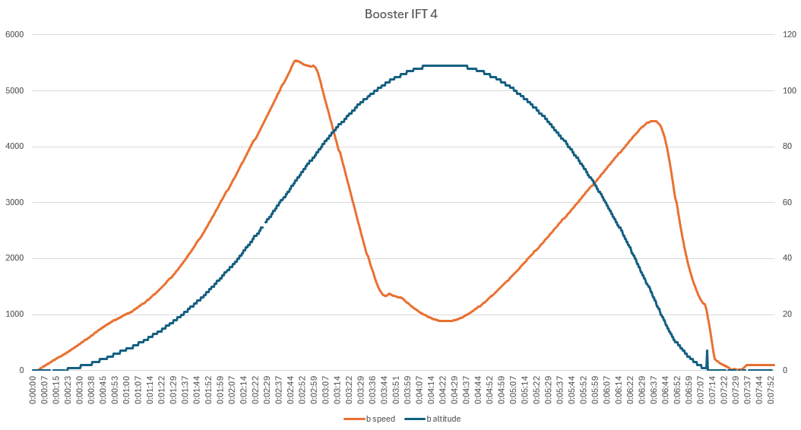
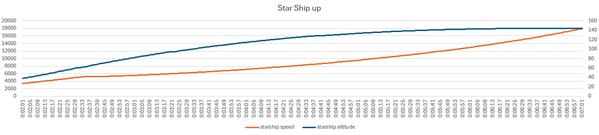

Dependencies
------------

* ffmpeg
  * Download from website
* Tesseract
  * winget install UB-Mannheim.TesseractOCR

References
----------
* IFT3 [1]: https://www.youtube.com/watch?v=9r5yupEUs4U&t=1752s
* IFT4: video captured from X stream
* IFT5: telemetry captured directly from X stream

Captured video info
--------------------
 Stream #0:0[0x1](und): Video: h264 (Main) (avc1 / 0x31637661), yuv420p(progressive), 1920x1080 [SAR 1:1 DAR 16:9], 10376 kb/s, 30 fps, 60 tbr, 30k tbn (default)

Line to get captures from video
-------------------------------
```bash
ffmpeg -i in/Spacex_ift4.mp4 -ss 00:00:15 -vf "fps=2" -vf "crop=1900:200:0:1900" out/img%03d.jpg
```

OCR of the data
---------------
asking copilot
prompt: 
  I need a python script to get all the texts from a image file

Response:
from PIL import Image
import pytesseract

def extract_text_from_image(image_path):
    image = Image.open(image_path)
    text = pytesseract.image_to_string(image)
    return text

To capture a region on live video
---------------------------------
You can use FFMPEG to capture a specific region of your screen at regular intervals. Here's a command that captures a region of the screen every second:

```bash
ffmpeg -f gdigrab -framerate 1 -offset_x 200 -offset_y 200 -video_size 640x50 -i desktop -vf fps=1 test/output_%04d.png
```

In this command:
- `-f gdigrab` specifies the input format (screen capture).
- `-framerate 1` sets the frame rate to 1 frame per second.
- `-offset_x 100 -offset_y 100` sets the top-left corner of the capture region.
- `-video_size 640x480` sets the size of the capture region.
- `-i desktop` specifies the input source (the desktop).
- `-vf fps=1` ensures that the output frame rate is 1 frame per second.
- `output_%04d.png` specifies the output file format, with each frame saved as a PNG file.

Feel free to adjust the `offset_x`, `offset_y`, and `video_size` values to capture the desired region of your screen. Let me know if you need any further assistance!


Capture from X streaming
------------------------
* Prepare environment
set path=D:\Apps\ffmpeg\bin;%path% 
set path=C:\Program Files\Tesseract-OCR;%path%  

* capture booster + starship + fligth time telemetry
  - Put stream in full screen
  - run script
    
    ffmpeg -f gdigrab -framerate 1 -offset_x 20 -offset_y 900 -video_size 1900x160 -i desktop -vf fps=1 tmp/output_%04d.png

Capture from recorded video
---------------------------

Steps
-----
* Capture the telemetry region each second


* Adjust the script to extract the region for mission time, speeds and altitudes, and process with OCR
  - Sample images:

  
  
  
  

Results IFT 3
--------------
Booster


StarShip


Results IFT 4
--------------
Booster


StarShip up


StarShip down


Results IFT 5
--------------
Booster


StarShip up


StarShip down


